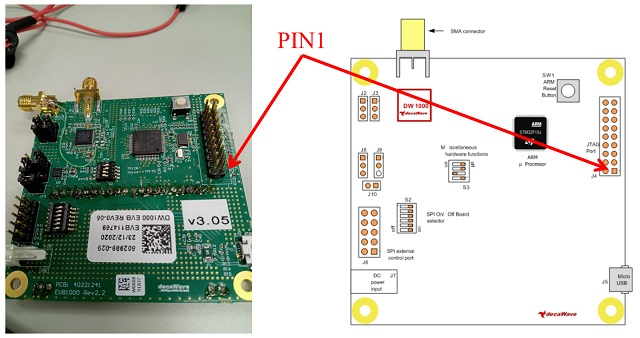

# Hardware setting

## Nucleo

You need to remove a CN2 jumper pin.


You need to connect 4 wires from CN4 to EVB1000.

| use | Pin | name       | purpose                       |
|-----|-----|------------|-------------------------------|
| x   | 1   | VDD_TARGET | power suply                   |
| o   | 2   | SWCLK      | clock                         |
| o   | 3   | GND        | ground                        |
| o   | 4   | SWDIO      | input (read) / output (write) |
| x   | 5   | NRST       | reset                         |
| x   | 6   | SWO        | not used.                     |


## EVB1000's pin



| function      | Pin | Pin | function |
|---------------|-----|-----|----------|
| VCC           | 1   | 2   | VCC      |
| JTRST         | 3   | 4   | GND      |
| J TDI         | 5   | 6   | GND      |
| J TMS (SWDIO) | 7   | 8   | GND      |
| J TCK (SWCLK) | 9   | 10  | GND      |
| GND           | 11  | 12  | GND      |
| J TDO         | 13  | 14  | GND      |
| ARM_RESET     | 15  | 16  | GND      |
| GND           | 17  | 18  | GND      |
| GND           | 19  | 20  | GND      |

## Wire color


| function | color  |
|----------|--------|
| VCC      | red    |
| GND      | black  |
| DATA     | green  |
| CLK      | gray   |
| RESET    | yellow |


# FAQ

## writer error

```
2022-08-14T15:03:41 ERROR flash_loader.c: flash loader run error
2022-08-14T15:03:41 ERROR common.c: stlink_flash_loader_run(0x8000000) failed! == -1
```

You just need to unplug/plug a usb cable from/to Nucleo board.

## connection order

1. EVB1000 turn on
2. connect Nucleo and EVB1000
3. Nucleo turn on with USB connection


## `st-flash` from command line

### st-flash write ./multiposition.bin 0x8000000

write

### st-flash erase

erase before write


### st-info --probe

you can see chipid means you can write the device.

## How to install `st-flash` 

```
cd ~myusername
mkdir stm32
cd stm32
git clone https://github.com/stlink-org/stlink
cd stlink
cmake .
make
```
https://freeelectron.ro/installing-st-link-v2-to-flash-stm32-targets-on-linux/
